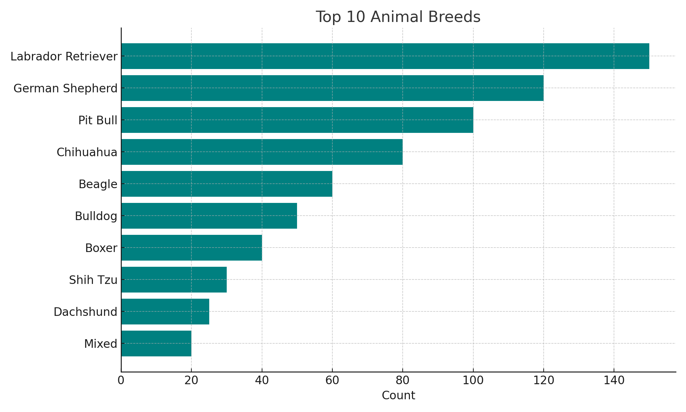
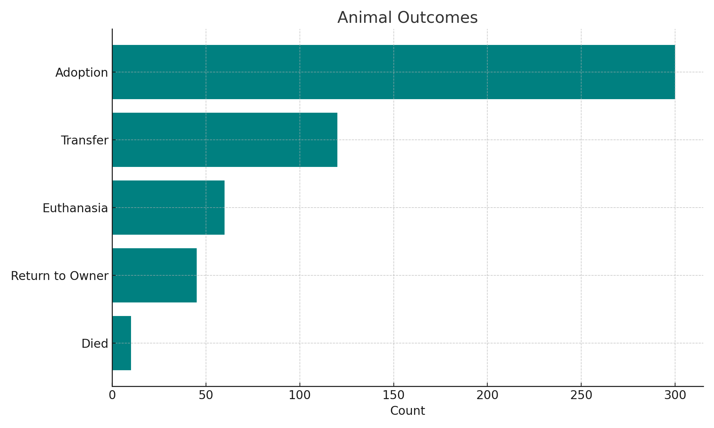
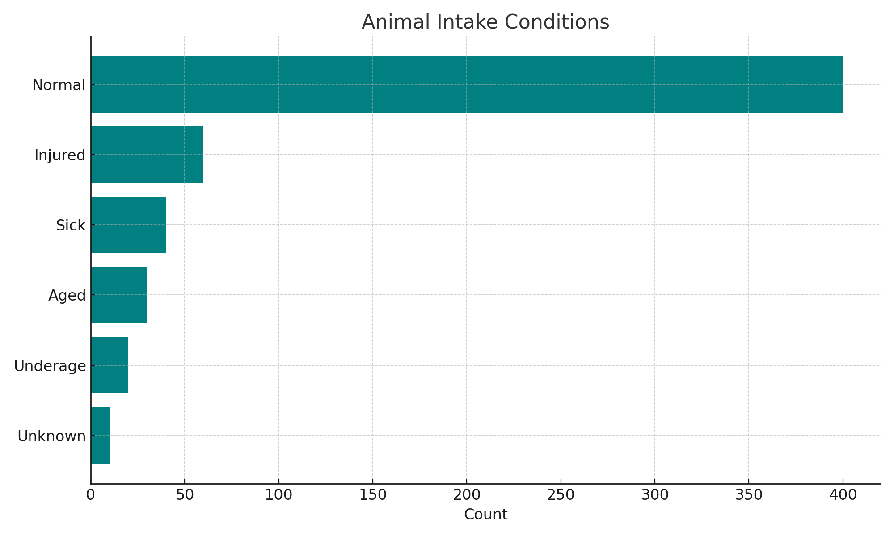

# CS-499: Computer Science Capstone

## 📌 Overview

This repository contains enhanced artifacts developed for the CS-499 Capstone course. Each artifact reflects growth in a key area of computer science, including software engineering, algorithms and data structures, and database design. Enhancements were made to improve usability, scalability, and maintainability, and to demonstrate mastery of core program outcomes.

---

## 🧩 Enhancement One: Software Design and Engineering

### 🔍 Artifact Overview

The original artifact is a Java-based contact management service (`ContactService`) that performed basic CRUD operations using a `HashMap`. It contained key fields like `contactId`, `firstName`, `lastName`, `phone`, and `address`, and focused on object-oriented programming and exception handling.

### ✅ Justification for Inclusion

This artifact highlights foundational design skills, and the enhancement — a **JavaFX GUI** — transformed it into a more complete, user-friendly application. Key skills demonstrated:

- Event-driven programming with JavaFX
- UI/UX layout considerations
- Modularity and separation of concerns
- Input validation and error handling

These improvements represent my growth into a full-stack mindset and align with industry expectations.

### 🎯 Course Outcomes Addressed

- Designed modular systems with a user-centric architecture.
- Applied JavaFX to build interactive and intuitive interfaces.
- Communicated effectively through visual design and code organization.

### 🔁 Reflection

Developing the GUI improved my understanding of architecture and usability. I faced challenges ensuring data consistency, managing input validation, and linking UI elements with backend logic. These experiences gave me a deeper appreciation of the user's perspective in software development.

- [🗂️ Original Code](https://github.com/katemoran02/CS-499/blob/main/Original%20Code%20One)
- [✨ Enhanced Code](https://github.com/katemoran02/CS-499/blob/main/Enhanced%20Code%20One)

---

## 🧮 Enhancement Two: Algorithms and Data Structures

### 🔍 Artifact Description

The original artifact was a CRUD-based `ContactService` implemented in Java, storing contacts in a `HashMap`.

### ✅ Why I Selected This Artifact

It was ideal for algorithmic enhancement — specifically, I added **undo/redo functionality** using stack data structures. This mirrors features seen in modern software editors and showcases algorithmic problem-solving in a real-world context.

### 🛠️ Enhancement Summary

- Introduced `undoStack` and `redoStack` to track state changes.
- Implemented deep copies and added a copy constructor to preserve integrity.
- Maintained separation of concerns and easy extensibility.

### 🔍 Skills Demonstrated

- Stack-based state management
- Object immutability and deep copying
- Logical design tradeoffs and clean abstractions

### 🎯 Course Outcome Alignment

> *“Design and evaluate computing solutions that solve a given problem using algorithmic principles and standards while managing trade-offs.”*

### 🔁 Reflection

This enhancement deepened my appreciation for immutability and state control. I overcame challenges related to deep-copy logic and learned how to create safer, more reliable systems.

- [🗂️ Original Code](https://github.com/katemoran02/CS-499/blob/main/Original%20Code%20Two)
- [✨ Enhanced Code](https://github.com/katemoran02/CS-499/blob/main/Enhanced%20Code%20Two)

---

## 🗃️ Enhancement Three: Database Development

### 🔍 Artifact Overview

The artifact I selected for the database category of my ePortfolio is a Python-based CRUD module built using the pymongo library to interact with a MongoDB database. This module was originally created during my coursework in CS 340: Client/Server Development. It was designed to support an animal shelter’s recordkeeping by connecting to a hosted MongoDB instance and performing create, read, update, and delete operations on animal data. The original implementation provided a functional baseline, but lacked depth in reporting and user feedback mechanisms.

### ✅ Justification for Inclusion

I selected this artifact because it demonstrates foundational database interaction skills that are essential for full-stack developers and data-oriented professionals. The original module showcased basic CRUD functionality, and for this milestone, I significantly enhanced it by introducing report generation capabilities using MongoDB’s aggregation framework.
I added a new method, generate_reports(), which creates three types of summaries: one by breed, one by outcome type, and one by intake condition. These reports answer common business questions an animal shelter might face, such as: "What are our most common breeds?", "What is the most frequent outcome for animals?", and "What condition are most animals in upon arrival?" These types of insights can guide decisions about resource allocation and operational focus.
To visually communicate these findings, I used the matplotlib library to generate horizontal bar charts for each report. These visualizations include:
•	Breed Chart: Highlights the top 10 most common breeds in the database.
•	Outcome Chart: Shows the distribution of animal outcomes, such as adoption or transfer.
•	Intake Chart: Illustrates the various conditions animals are in when they enter the shelter.
These enhancements go beyond simple querying and showcase analytical thinking, data summarization, and visual storytelling, which are critical in modern computing roles.

### 🧠 Skills Demonstrated

- MongoDB aggregation (`$group`, `$sort`)
- Data reporting and summarization
- Error management and system robustness

### 🎯 Course Outcomes Addressed

Through this enhancement, I made significant progress toward the following Computer Science program outcomes:
•	Design and evaluate computing solutions: I implemented a function that solves real-world data summarization problems using MongoDB’s aggregation framework.
•	Demonstrate the use of innovative tools and techniques in computing practices: By applying MongoDB operators like $group and $sort, and integrating data visualization tools like matplotlib, I produced actionable insights from raw data.
•	Develop a security mindset: This is reflected in the validation checks, error handling, and logging introduced to improve the robustness and maintainability of the module.

### 🔁 Reflection

Before this enhancement, I had a very CRUD-centric view of MongoDB. However, learning to use aggregation pipelines shifted my understanding of what the database is capable of. I realized that real-world software often needs to support operational and strategic decision-making, not just store and retrieve data.
One challenge I faced was crafting aggregation pipelines that returned meaningful and efficient results, especially considering edge cases like missing or null values. For example, some animals in the database did not have a breed listed, so I had to account for these records gracefully without skewing the data.
Another challenge was implementing visualizations in a way that felt polished and professional. I had to experiment with different chart types, sort orders, and layouts to ensure the charts were readable and useful. Creating a method that saved charts to disk also made the module more adaptable for reports or presentations.

- [🗂️ Original Code](https://github.com/katemoran02/CS-499/blob/main/Original%20Code%20Three)
- [✨ Enhanced Code](https://github.com/katemoran02/CS-499/blob/main/Enhanced%20Code%20Three)

---

## 🎥 Code Review Video

View a walkthrough of the enhancements and design decisions in my project:

▶️ [Watch on Screencast](https://app.screencast.com/OQmUmbeysDUQA)

---

## 🙋‍♀️ About Me

**Kate Moran**  
B.S. in Computer Science | Concentration: Cybersecurity  
🔗 [GitHub](https://github.com/katemoran02)  

---

## 📝 License

This project is part of academic coursework and is shared for educational purposes.

